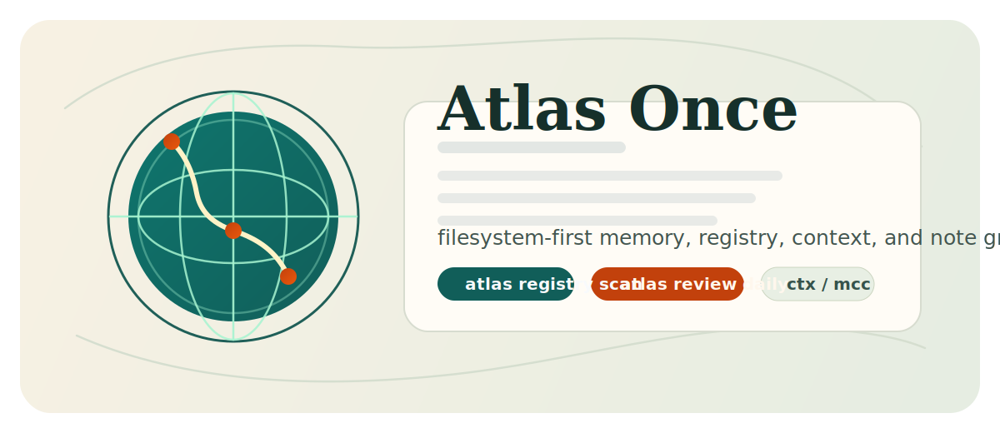

[](https://github.com/nshkrdotcom/atlas_once)
[](LICENSE)



# Atlas Once

Atlas Once is a filesystem-first memory and context system for local workspaces. It keeps durable notes in plain files, tracks repo state across multiple roots, and builds deterministic LLM-ready bundles through one canonical CLI:

```bash
atlas
```

## What It Does

- manages durable notes, captures, reviews, and promotion workflows under a configurable data root
- keeps operational state under `~/.atlas_once` and user config under `~/.config/atlas_once` by default
- scans repo roots, resolves refs and aliases, and records repo capabilities for context selection
- builds repo, stack, notes, and ranked multi-repo context bundles
- uses Dexterity for Elixir ranked file selection without writing `.dexter.db` or `.dexterity/*` into source repos
- exposes repo-local Elixir code-intelligence commands backed by Dexter and Dexterity
- supports budget-first ranked selection with byte caps, estimated token caps, and project priority tiers
- keeps short helper commands such as `ctx`, `mixctx`/`mctx`, and `mcc` installed on `PATH`
- exposes a stable `--json` envelope for agents and automation
- records an append-only event log at `~/.atlas_once/events.jsonl`
- ships packaged profiles, including `default` and `nshkrdotcom`

## Installation

Recommended:

```bash
uv tool install git+https://github.com/nshkrdotcom/atlas_once
atlas install
```

Optional shell helper setup:

```bash
atlas config shell install
```

That installs the managed `d` helper. Normal command use does not require aliases.

## Quick Start

Human-oriented:

```bash
atlas status
atlas next
atlas today
atlas registry scan
```

Agent-oriented:

```bash
atlas --json status
atlas --json next
atlas --json resolve <ref>
atlas --json context repo <ref> current
atlas --json context ranked groups
atlas --json context ranked repos gn-ten
atlas --json context ranked status gn-ten
atlas --json context ranked gn-ten
atlas --json context ranked tree gn-ten
```

## Repo-Local Elixir Code Intelligence

Inside any Elixir Mix repo, use the agent surface first. Atlas resolves the current repo, prefers a fresh Atlas-managed shadow index when the indexed source snapshot still matches the current source snapshot, and maps output back to source paths:

```bash
atlas agent status
atlas agent task "add streaming support"
atlas agent find Agent
atlas agent def ClaudeAgentSDK.Agent
atlas agent refs ClaudeAgentSDK.Agent
atlas agent related lib/claude_agent_sdk/agent.ex
atlas agent impact lib/claude_agent_sdk/agent.ex
atlas --json agent task "add streaming support"
```

The lower-level primitives remain available for specific lookups and debugging:

```bash
atlas index
atlas symbols Agent --limit 10
atlas def ClaudeAgentSDK.Agent
atlas def ClaudeAgentSDK.Agent new 1
atlas refs ClaudeAgentSDK.Agent
atlas ranked-files --active lib/claude_agent_sdk/agent.ex --limit 10
atlas impact lib/claude_agent_sdk/agent.ex --token-budget 5000
atlas repo-map --active lib/claude_agent_sdk/agent.ex --limit 10
atlas intelligence start
atlas intelligence warm .
atlas intelligence status
```

`atlas agent task "<goal>"` is the default Codex-friendly entrypoint. It starts with a cheap implementation-first repo-structure scan, so umbrella or multi-Mix repos still return useful shape and key files even when Dexterity is slow. When the goal has useful search terms, Atlas adds bounded Dexterity enrichment: implementation-first symbol searches, ranked files, and optional impact context for active/edited files. Backend enrichment has hard timeouts and partial-result reporting under `data.backend_errors`; `atlas agent find` also falls back to repo-structure module matches if Dexterity cannot answer. It intentionally does not call `repo-map`; use `atlas agent map` only when a full map is explicitly worth the latency. Use `atlas intelligence warm <ref-or-path>` to prewarm specific active repos without starting workers for every configured repo.

Ranked and impact commands default to repo-source results so stdlib, `_build`, `deps`, and vendored dependency paths do not crowd out the files an agent should edit. Add `--include-external` when dependency or stdlib context is explicitly useful. `symbols` ranks primary implementation paths ahead of examples/tests and `symbols`/`refs` JSON includes `data.result_groups` so agents can separate implementation, tests, examples, docs, support, and external hits without another grep pass. `atlas files <pattern>` uses Dexterity first, then falls back to an implementation-first source scan when the backend returns no file matches.

Use `--project <ref-or-path>` when running from outside the repo:

```bash
atlas --json agent find Agent --project ~/p/g/n/claude_agent_sdk
```

Raw Dexter remains available when an agent needs the underlying module lookup or reference command:

```bash
atlas dexter lookup ClaudeAgentSDK.Agent
atlas dexter refs ClaudeAgentSDK.Agent
```

Use `atlas def <Module>` or `atlas dexter lookup <Module>` for direct module location. Use the Dexterity-backed commands for ranked, symbol, impact, dependency, cochange, and export-analysis workflows. Read-only Dexter/Dexterity calls cache successful results against the current shadow index stamp; JSON metadata reports this under `data.tool.cache`. `atlas agent ...` commands use the persistent intelligence service when it is running, with subprocess fallback if the service is disabled or unavailable.

## Ranked Contexts

`atlas context ranked` is the main multi-repo code-intelligence flow.

```bash
atlas context ranked groups
atlas context ranked groups --names
atlas context ranked repos <group>
atlas context ranked repos <group> --names
atlas context ranked prepare <group>
atlas --json context ranked status <group>
atlas context ranked <group>
atlas context ranked tree <group>
```

Use `atlas context ranked groups` to list configured ranked groups without preparing or querying Dexterity. Add `--names` when you only need group names. Use `atlas context ranked repos <group>` to list the repos and variants that a group resolves to, including whether each repo variant has monorepo project overrides; add `--names` for just the repo labels.
Render and status auto-prepare the group when the prepared manifest is missing, stale, or points at deleted files. `prepare` prewarms the prepared manifest, but it does not run `dexterity.index`; keep indexes warm with `atlas index start` or refresh them explicitly with `atlas index refresh`. If a ranked query is unavailable or times out, Atlas falls back to deterministic local `lib/` file selection instead of blocking the render.
Use `atlas context ranked tree <group>` to inspect the file tree for the same prepared repo set without rendering file contents. The tree command is monorepo-aware: it shows each discovered source project under repos such as `citadel` or `jido_integration`, including projects that ranked content selection excludes for budget/policy reasons. It defaults to implementation-first directories like `lib/`, `test/`, `tests/`, `src/`, `config/`, and `priv/`, walks all files under those included prefixes unless `--max-depth` is set, and skips generated or dependency directories such as `_build`, `deps`, `.git`, and `node_modules`.

For the packaged `nshkrdotcom` profile, the first-class sample group is `gn-ten`:

- `app_kit`
- `extravaganza`
- `mezzanine`
- `outer_brain`
- `citadel`
- `jido_integration`
- `execution_plane`
- `ground_plane`
- `stack_lab`
- `AITrace`

`gn-ten` is not hard-coded into the command implementation. It is a normal managed group seeded by the packaged `nshkrdotcom` ranked config. That config also defines reusable `gn-ten` repo variants for the large monorepos; those variants carry the custom project controls, budgets, and excludes. New groups can reuse them with refs like `jido_integration:gn-ten`, or use plain refs such as `AITrace` for the default variant.

Rebuild that index from the current workspace state:

```bash
atlas registry scan
atlas context ranked repos gn-ten
atlas context ranked gn-ten
atlas context ranked tree gn-ten
```

Keep ranked Elixir indexes warm during active work:

```bash
atlas index watch --once
atlas index start
atlas --json index status
atlas --json index refresh --project app_kit
atlas --json context ranked gn-ten --wait-fresh-ms 1200
```

`atlas index start` launches the polling watcher in the background and writes logs to `~/.atlas_once/logs/index-watcher.log`. `atlas index watch --once` performs one foreground polling pass. `atlas index watch --daemon` is the foreground loop used by `index start` and by external supervisors. Ranked rendering remains non-blocking by default; `--wait-fresh-ms` opts into a bounded wait and JSON output includes `index_freshness`.

Atlas freshness is deterministic. It compares the current Elixir source snapshot with the snapshot last successfully indexed by Dexterity; elapsed time alone does not make an unchanged repo stale.

`atlas config shell install` installs a bash snippet that starts `atlas intelligence start` and `atlas index start` when a new interactive shell loads it. Set `ATLAS_ONCE_SHELL_AUTOSTART=0` before sourcing that snippet to opt out.

Stop it cleanly with:

```bash
atlas index stop
```

JSON stop payloads separate `signal_sent`, `force_escalated`, and `stopped`; only `stopped: true` means the watcher process has actually exited. A normal stop requests clean shutdown first and escalates if the process tree does not exit.

Force recovery from stale state:

```bash
atlas index stop --force
```

Reapply the repo-owned packaged defaults after pulling a newer Atlas Once version:

```bash
atlas config ranked install --force
```

Add a new explicit group without hand-editing JSON:

```bash
atlas config ranked group add my-slice app_kit:gn-ten jido_integration:gn-ten AITrace
atlas config ranked group add my-slice app_kit jido_integration --variant default
```

The ranked config lives at:

```bash
atlas config ranked path
```

Atlas currently supports one ranked schema version: `3`.

The managed config contains:

- `defaults.runtime`
- `defaults.registry`
- `defaults.strategies`
- `defaults.project_discovery`
- `repos`
- `groups`

Key ranked-context behaviors:

- Elixir ranking runs per Mix project, not per repo.
- Default project discovery excludes `_legacy`, `test`, `tests`, `fixtures`, `examples`, `support`, `tmp`, `dist`, `deps`, `docs`, `bench`, and `vendor`.
- Groups can target precise workspace roots with `selectors[].roots`.
- Budget-first selection is first class: `max_bytes`, `max_tokens`, and `priority_tier` now sit beside `top_files`.
- Repo definitions can override individual Mix projects with `top_files`, `top_percent`, `max_bytes`, `max_tokens`, `priority_tier`, or `exclude`.
- Prepared manifests include repo-level and project-level selection metadata so selection is auditable.
- If repo layout drifts and a configured project override no longer exists, `prepare` warns with `reason=unknown-project-override` and records `unmatched_project_overrides` in `status` output instead of aborting the whole group.
- If a cached repo manifest points at files that were deleted, the next `prepare` rebuilds that repo cache automatically instead of preserving a broken render path.

Example selector for self-owned primary Elixir repos under `~/p/g/n`:

```json
{
  "owner_scope": "self",
  "primary_language": "elixir",
  "relation": "primary",
  "roots": ["~/p/g/n"],
  "variant": "default"
}
```

Example per-project override for a monorepo:

```json
{
  "connectors/github": {"top_files": 6, "priority_tier": 1},
  "core/platform": {"top_files": 6, "priority_tier": 1},
  "apps/example_app": {"exclude": true}
}
```

Reapply the shipped ranked defaults from the packaged profile template with:

```bash
atlas config ranked install --force
```

## Shadow Workspaces

Dexterity indexing runs against Atlas-managed shadow workspaces under:

```text
~/.atlas_once/code/shadows/
```

Each shadow workspace mirrors one Mix project with real directories and symlinked source files plus local Dexterity state. This keeps `.dexter.db`, `.dexterity/*`, and Atlas/Dexterity lock files out of source repos while preserving deterministic ranking behavior. Atlas serializes Dexterity access per shadow workspace and retries known transient store-lock failures such as `Database busy`. Agent commands use the same default query budget as the backend service, 30 seconds, and a 10-second lock budget. Override them with `ATLAS_ONCE_AGENT_QUERY_TIMEOUT_SECONDS` and `ATLAS_ONCE_AGENT_LOCK_TIMEOUT_SECONDS` only when the backend health policy needs to change. Lower-level commands use `ATLAS_ONCE_INTELLIGENCE_LOCK_TIMEOUT_SECONDS`; disable read-only query caching with `ATLAS_ONCE_INTELLIGENCE_CACHE=0`.

Read-only code-intelligence query cache entries live under:

```text
~/.atlas_once/code/query_cache/
```

The optional persistent intelligence service lives under:

```text
~/.atlas_once/code/intelligence_service/
```

It runs one Atlas daemon and lazily starts bounded Dexterity MCP workers only for shadows that are actually queried. Defaults are four workers, a five-minute idle TTL, and a 30-second request timeout. Timed-out or errored workers are closed and removed from the pool before fallback. Override with `ATLAS_ONCE_INTELLIGENCE_SERVICE_MAX_WORKERS`, `ATLAS_ONCE_INTELLIGENCE_SERVICE_IDLE_TTL_SECONDS`, `ATLAS_ONCE_INTELLIGENCE_SERVICE_REQUEST_TIMEOUT_SECONDS`, or disable service use with `ATLAS_ONCE_INTELLIGENCE_SERVICE=0`.

Watcher state lives under:

```text
~/.atlas_once/index_watcher/
```

It is rebuildable state and can be inspected with `atlas --json index status` or cleared with `atlas index stop --force` when recovering from a stale process marker.

## Typical Flows

Resolve and scan:

```bash
atlas config show
atlas registry scan
atlas registry list
atlas resolve <ref>
```

Build context:

```bash
atlas context repo <ref> current
atlas context stack 1 3 5
atlas index status
atlas index refresh --project <ref>
atlas context ranked gn-ten
atlas context ranked tree gn-ten
atlas context ranked owned-elixir-all
```

Capture and promote:

```bash
atlas capture --project <ref> --kind decision --stdin
atlas review inbox
atlas promote auto
```

Notes:

```bash
atlas note new "Routing notes" --project <ref> --body-stdin
atlas note find routing daemon
atlas note sync
```

## Development

In a repo checkout:

```bash
git clone https://github.com/nshkrdotcom/atlas_once
cd atlas_once
uv sync --dev
uv run atlas
```

Quality gates:

```bash
uv run pytest
uv run ruff check .
uv run mypy src
```

## Docs

- [Install And Profiles](docs/install_and_profiles.md)
- [Architecture](docs/architecture.md)
- [CLI Reference](docs/cli_reference.md)
- [Human Onboarding](docs/human_onboarding.md)
- [Agent Onboarding](docs/agent_onboarding.md)
- [Ranked Contexts](docs/ranked_contexts.md)
- [Feature Checklist](docs/feature_checklist.md)
